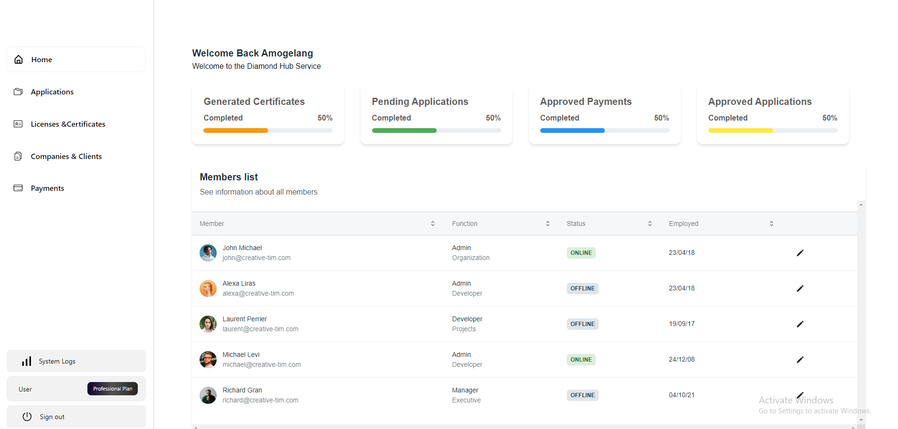
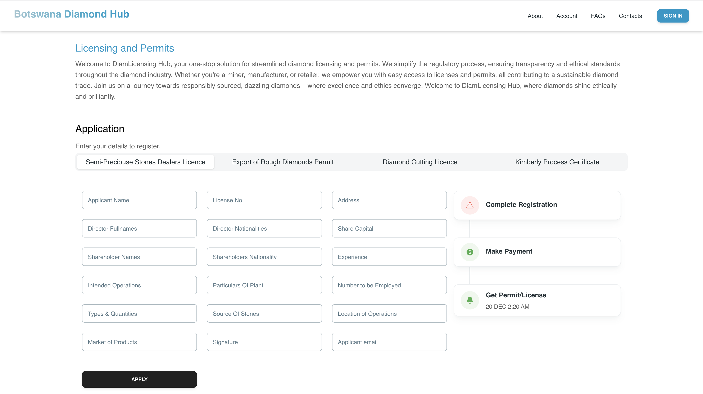

 
  

<!-- TABLE OF CONTENTS -->
<h2 id="table-of-contents"> :book: Structure</h2>

  
Table of Contents

  <ol>
    <li><a href="#introduction"> ➤ Introduction</a></li>
    <li><a href="#problem-statement"> ➤ Problem Statement</a></li>
    <li><a href="#our-solution"> ➤ Our Solution</a></li>
    <li><a href="#research"> ➤ Research</a></li>
    <li><a href="#stack"> ➤ Stack</a></li>
    <li><a href="#team"> ➤ Team</a></li>
    
  </ol>

<!-- Introduction -->

<h1  id="#introduction" align="center">Diamond Hub Services Portal-Hackathon Submission</h1>
<h3 align="center"> 
The Diamond Hub faces a significant challenge with its manual registration process, countless visits to various government offices to make registration payments and long registration queues. As a result, the client often has to do the aforementioned along with their prior obligations during government office hours. 
 
Moreover, government officials are tasked with their own manual administrative work such as verification of applications, payment processing and updating the diamond hub reports.
 
Henceforth, the need for a solution that provides a seamless process that enables stakeholders such as clients (those who are filling for registration) and Diamond Hub Officers to carry out their respective obligations in a timely and cost-effective manner on one platform.
</h3>  

 

<!-- PROBLEM STATEMENT -->
<h2 id="problem-statement"> :pencil: Problem Statement</h2>

 
The existing diamond hub system is outdated and manual, necessitating an automated replacement. Key challenges include outdated technology, inefficient processes, data security, integration, scalability, user adoption, budget constraints, and minimizing operational disruption.

<!-- Solution -->
<h2 id="our-solution"> :computer: Our Solution </h2>

_Web link. Please refer to the [Link] (​https://diamond-hub.testlive.space/home)_  and follow the instructions below 

<h4>Getting Started As an Applicant </h4>

1. Go to (​https://diamond-hub.testlive.space/home) platform
2. Navigate to the preferred Tab (Diamond Cutting,Export of Rough Diamonds, etc)
3 Fill in the neccessary information then submit 
4 After submission you will see a payment modal for Application fees.
5 After payment user will await response from the hub either an issuance of permit/certificate or license via email

<h4>Getting Started As Admin User</h4>
* Go to (​https://diamond-hub.testlive.space/) platform
1. Login to the platform using the following credentials
- email: `admin@gmail.com`
- password: `adminpass123`
2. Select anyone of the 4 Options; 
- Applications 
- Companies/Clients 
- Payments
- Reports
3. Start reviewing and approving aplications for license
4. Issue permits , licenses and certificates 
6. Applicant recieves permit,certificate via email  and also get sms notification 

<!-- analytics-->
<h2 id="research"> 📋: Research Findings</h2>

 
<h4>Findings</h4>
  

 
How Others Have Solved the Problem
In relation to South Africa, accessibility of Verification of Licenses and certificate Status forms has been made available online for filling and submission. In addition, the QR codes  platform is also being used to check the verification of different certificate and permit status along with phone-call enquiry. This reduces the public having to go to government offices to complete the different diamond hub services. 

<h4>Our Solution</h4>
The solution, this will allow for online license,permit,certificate registration through the availability of online forms, the upload of support documents, execution of online payment processing, remote management of objections and applications in real-time which will consequently ensure a faster and seamless experience for both the client and administrative officer. The solution features a modular architecture and thus can provide services on mobile applications, web applications, making it more accessible and allowing for ease of use with both a web and mobile usage.

<h4>Lessons Learnt</h4>
During information and data collection processes, the researchers found people seek more convenience and time are a top priority for them . This has led to the need for services to be accessed online and reduce the need for physical attendance. With the increase in digitization of other services such as banking and retail, the preference for accessing and completing tasks and services online has increased the appetite for online services by the public.

 
 

<!-- PREREQUISITES -->
<h2 id="stack"> :computer: Stack</h2>

<!--This project is written in Python and Javascript  -->
The stack used to build this project:
* Nodejs(endpoints)
* Reactjs(frontend)
* PocketBase (opensource centralised database)
* Tailwind Css
* Postman(Testing & creating Developer Docummentation)

_Please refer to the [Link](https://github.com/Xavier-Botswana/Diamond-HUB-Services-Hackathon)_ to access the code-base

<!-- analytics-->
<h2 id="demo"> 📋: Demo  </h2>

 
  Portal Screens [Admin]

 
  
 
  

  

 
  

_Please refer to the [Link] (​https://github.com/Xavier-Botswana/Diamond-HUB-Services-Hackathon)_ to access the web portal. The credentials are in the <a href="#our-solution">Our Solution</a> section above.
 
 

 

<!-- analytics-->
<h2 id="doc"> 📋: Link to the code-base </h2>

 
  Code-Base

 
  

_Please refer to the [Link](https://github.com/Xavier-Botswana/Diamond-HUB-Services-Hackathon)_ to access the code-base
 
<!--  

 

<!-- analytics-->
<h2 id="team"> 📋: Team-Xavier Africa</h2>

 
<!-- <table>
  <tr>
   <td align="center"><a href="https://github.com/identicons/jasonlong.png"> <b>Leloba</b></a> <a href="#eventOrganizing-lolo" title="Project Setup">📋</a> <a href="#example-lolo" title="Code">💻</a></td>
<td align="center"><a href="https://github.com/identicons/jasonlong.png"> <b>Thabang</b></a> <a href="#eventOrganizing-lolo" title="Project Setup">📋</a> <a href="#example-lolo" title="Code">💻</a></td>
<td align="center"><a href="https://github.com/identicons/jasonlong.png"> <b>Duduetsang</b></a> <a href="#eventOrganizing-thabang" title="Project Setup">📋</a> <a href="#example-Dudu" title="Code">💻</a></td>
    <td align="center"><a href="https://github.com/identicons/jasonlong.png"> <b>Withus</b></a> <a href="#eventOrganizing-withus" title="Project Setup">📋</a> <a href="#example-withus" title="Code">💻</a></td>
  
</table> -->

 

